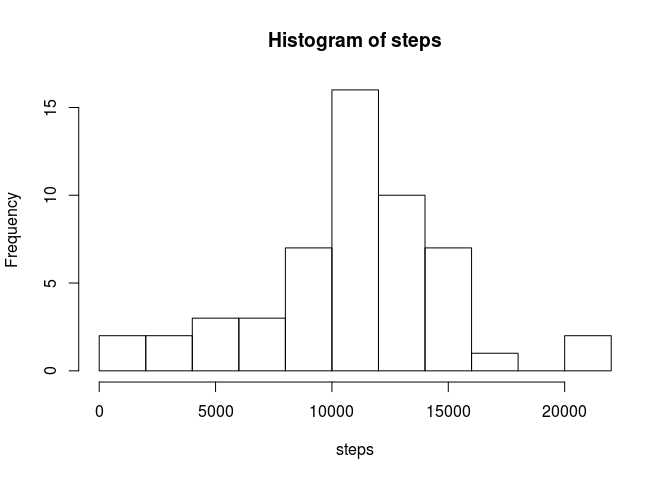
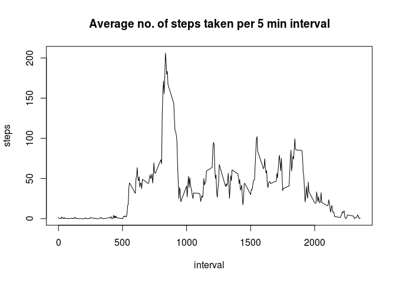
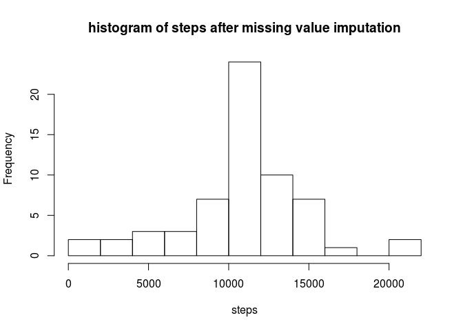
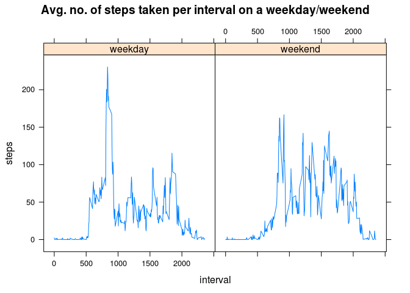

# Reproducible Research: Peer Assessment 1
### Author - Subhajit Gupta
### Date : 15th March 2015
### Version : 1


### Loading and preprocessing the data

Notes: Set working directory to the location of forked repo. Unzipped "activity.zip", and read in the data. 

R code:


```r
rm(list=ls())#clear existing workspace
options(scipen=10)
wrkdir<-"/home/shibai/Courses/reproducible~research/RepData_PeerAssessment1" #working directory
setwd(wrkdir)
unzip("activity.zip")#unzip file
filename<-unzip("activity.zip",list=T)$Name#extract data set name
AMdata<-read.csv(filename,head=T)
```

### Histogram of total no. of steps taken each day

R code & plot:


```r
stepsperday<-aggregate(steps~date,data=AMdata,FUN=sum)
with(stepsperday,hist(steps,breaks=10))
```

 

```r
stepsperday.mean<-mean(stepsperday$steps)
stepsperday.median<-median(stepsperday$steps)
```

#### Results: 

#### Mean no. of steps taken each day is 10766.19.  
#### Median no. of steps taken each day is 10765  

### Time series plot of the average number of steps taken (averaged across all days) versus the 5-minute intervals

R code & plot:


```r
avgstepsperint<-aggregate(steps~interval,data=AMdata,FUN=mean)
with(avgstepsperint,plot(interval,steps,type="l",main="Average no. of steps taken per 5 min interval"))
```

 

```r
m.step<-max(avgstepsperint$steps)
m.int.step<-avgstepsperint[avgstepsperint$steps==m.step,1]
```

#### Results: On an average the 5 min. interval 835 contains the maximum number of steps

### Missing value imputation strategy: 
#### Notes: The mean no of steps per interval for the non-missing data are calculated. The missing values are replaced by them per interval.

R code:

```r
lmiss<-length(which(complete.cases(AMdata)==F))
AMdata.missing<-AMdata[!complete.cases(AMdata),]
AMdata.complete<-AMdata[complete.cases(AMdata),]
stepsperday.c<-aggregate(steps~interval,data=AMdata.complete,FUN=mean)
s1<-merge(AMdata.missing[,-1],stepsperday.c,by=c("interval"),all.x=T)
AMdata.imputed<-rbind(AMdata.complete,s1)
```

#### Results: The total no. of missing values are 2304

### histogram of the total number of steps taken each day after missing values were imputed

R code & plots:


```r
stepsperday.i<-aggregate(steps~date,data=AMdata.imputed,FUN=sum)
with(stepsperday.i,hist(steps,breaks=10,main="histogram of steps after missing value imputation"))
```

 

### Panel plot comparing the average number of steps taken per 5-minute interval across weekdays and weekends

R code and plots:


```r
AMdata.imputed$dayname<-weekdays(as.POSIXct(AMdata.imputed$date,"%d/%m/%Y"))
AMdata.imputed$daytype<-ifelse(AMdata.imputed$dayname %in% c("Saturday","Sunday"),
                               "weekend","weekday")
AMdata.imputed$daytype<-as.factor( AMdata.imputed$daytype)
library(lattice)
avgstepsperint.i<-aggregate(steps~interval+daytype,data=AMdata.imputed,FUN=mean)
xyplot(steps~interval|daytype,
       data=avgstepsperint.i,
       type=c("l"),
       main="Avg. no. of steps taken per interval on a weekday/weekend")
```

 
